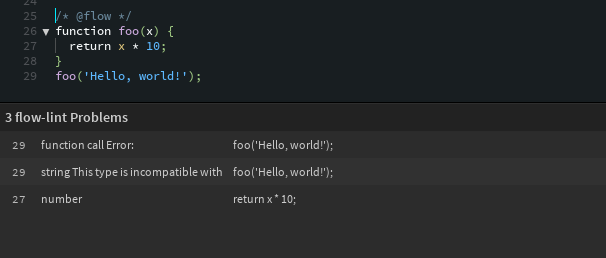

# Flow linter for Brackets

Lint your javascript files using [flow](http://flowtype.org/) by Facebook.

## Usage

+ Install [flow](http://flowtype.org/docs/getting-started.html#_)
+ Add `/* @flow */` to the js files you want to check

If you changed the linting options inside the preference file you might need to add `flow-lint` to your linters inside the `brackets.json`

## Simple example

